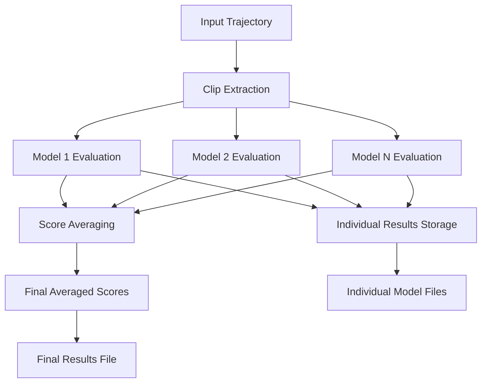

# AI Agent Step-Level Evaluation System

A comprehensive evaluation system for AI agent trajectory data with advanced sequential clip evaluation and multi-model scoring. This system provides detailed, step-by-step evaluation of AI agent responses containing XML-formatted tool calls from multiple MCP (Model Context Protocol) servers, with context-aware evaluation and comprehensive category-level assessment.

## 🚀 Latest Updates (Version 2.0)

### New Advanced Evaluation Features
- **Sequential Context-Aware Evaluation**: Each clip is evaluated with complete context from all previous clips and their evaluation results
- **Enhanced Category Assessment**: Comprehensive MCP category evaluation after individual clip assessments  
- **Final Trajectory Scoring**: Overall trajectory assessment using all clips and category evaluations
- **Multi-Model Robustness**: Support for 6+ LLM providers with advanced score averaging and bias reduction
- **Integrated Testing**: Comprehensive test suite with `test_integration.py` for system verification

### Architecture Improvements
- **Simplified Service Layer**: Streamlined `evaluation_service.py` focused on core functionality
- **Unified Entry Point**: `run_evaluation.py` now handles all execution logic and multi-model configuration
- **Enhanced Data Structures**: Rich evaluation metadata with individual model tracking and category assessments

## Table of Contents

1. [Project Overview](#1-project-overview)
2. [System Architecture](#2-system-architecture)
3. [Data Preprocessing Process](#3-data-preprocessing-process)
4. [Step-Level Evaluation Process](#4-step-level-evaluation-process)
5. [Multi-Model Evaluation System](#5-multi-model-evaluation-system)
6. [Installation and Setup](#6-installation-and-setup)
7. [Usage Examples](#7-usage-examples)
8. [Configuration Options](#8-configuration-options)
9. [Testing and Verification](#9-testing-and-verification)
10. [Output Format](#10-output-format)

## 1. Project Overview

### Purpose and Goals

This system is designed to evaluate AI agent trajectories that utilize multiple tools to accomplish complex tasks. Instead of providing a single holistic score, the system breaks down agent responses into sequential **clips** and evaluates each clip independently using large language models (LLMs). This approach provides granular insights into:

- Tool usage effectiveness
- Reasoning quality at each step
- Task progression and completion
- Context utilization between steps

### Key Features

- **Advanced Sequential Evaluation**: Context-aware evaluation with comprehensive trajectory assessment
- **Multi-Tool Support**: Handles 4+ MCP servers (microsandbox, deepsearch, tavily, perform_web_task) 
- **Comprehensive Context Chaining**: Each evaluation includes summaries and results from ALL previous clips
- **Category-Level Assessment**: Detailed evaluation for each MCP tool category with specialized metrics
- **Final Trajectory Scoring**: Complete trajectory evaluation using all clips and category assessments
- **Multiple LLM Providers**: Supports 6+ providers (OpenAI, Google, Anthropic, DeepSeek, Kimi, Vertex AI)
- **Multi-Model Evaluation**: Parallel evaluation with multiple LLMs for reduced bias
- **Advanced Score Averaging**: Sophisticated aggregation with mode selection and reasoning preservation
- **Individual Model Tracking**: Comprehensive per-model result storage and analysis
- **Embedded Results**: Rich evaluations embedded directly into agent responses
- **Robust Error Handling**: Graceful failure handling without mock data generation
- **Integrated Testing**: Built-in test suite for system verification and API connectivity
- **Batch Processing**: Efficient evaluation of multiple files with progress tracking

### Supported Tool Types

| Tool Type | Description | Use Cases | Evaluation Metrics |
|-----------|-------------|-----------|-------------------|
| **MicroSandbox** | Code execution environment | Python scripting, data analysis, algorithm implementation | Code Correctness, Computational Efficiency, Result Interpretation |
| **DeepSearch** | Research and information gathering | Literature review, fact-finding, comprehensive research | Information Relevance, Source Quality, Information Synthesis |
| **Tavily** | Advanced web search and extraction | Real-time search, content extraction, web crawling | Information Relevance, Content Extraction, Goal Achievement |
| **Perform Web Task** | Comprehensive web automation | Google search, web navigation, structured data extraction | Tool Use Quality, Content Extraction, Interaction Quality |

## 2. System Architecture

The system follows a clear separation of concerns with two main phases:

```
Raw Agent Data → Preprocessing → Clean Data → Evaluation → Evaluated Results
     ↓                ↓              ↓           ↓            ↓
 demo01.jsonl → preprocess_agent → preprocessed → step_level → final_results
                    _data.py        _data.jsonl   _evaluator     .jsonl
                                                    .py
```

### 2.1 Enhanced Workflow with File Splitting and Batch Processing

```
Large Dataset → Preprocessing → Split Files → Batch Evaluation → Aggregated Results
     ↓               ↓              ↓              ↓                ↓
demo02.jsonl → preprocess_agent → predemo02/ → run_evaluation → multiple_eva.jsonl
  (97 tasks)      _data.py        ├─demo0201.jsonl  --batch-folder   ├─demo0201_eva.jsonl
                 --split-size 10  ├─demo0202.jsonl                   ├─demo0202_eva.jsonl
                                  ├─...                               ├─...
                                  └─demo0210.jsonl                   └─demo0210_eva.jsonl
                                    (7 tasks)                         (evaluated)
```

### Core Components

1. **`run_evaluation.py`**: Main CLI entry point and workflow orchestration
2. **`evaluation_service.py`**: Service layer managing the entire evaluation pipeline
3. **`preprocess_agent_data.py`**: Data cleaning, validation, and normalization
4. **`step_level_evaluator.py`**: Core evaluation logic and clip processing
5. **`llm_api_clients.py`**: LLM provider integrations and API management

## 3. Data Preprocessing Process

### 3.1 Preprocessing Indicators and Rules

The preprocessing phase applies three critical filters to ensure data quality:

#### 3.1.1 Tool-Call Frequency Control (β-Threshold)
- **Purpose**: Remove samples with excessive tool calls that may indicate stuck loops or inefficient behavior
- **Default Threshold**: 15 tool calls per sample
- **Implementation**: Counts all XML tags matching the four MCP server patterns
- **Action**: Samples exceeding the threshold are discarded with logging

#### 3.1.2 Duplicate Tool-Call Detection
- **Purpose**: Eliminate redundant or repeated tool calls that don't contribute to task progression
- **Detection Method**: 
  - Identifies consecutive identical tool calls within the same server type
  - Compares tool call content for exact matches
  - Checks for identical call patterns with same parameters
- **Action**: Samples with detected duplicates are removed

#### 3.1.3 XML Format Normalization
- **Purpose**: Ensure proper XML structure for reliable parsing
- **Validation Checks**:
  - Matching opening and closing tags
  - Proper tag nesting
  - Valid XML syntax
- **Auto-Correction**: Attempts to fix minor issues like missing closing tags
- **Metadata**: Records correction actions in sample metadata

### 3.2 Preprocessing Operation Procedure

#### Step 1: Data Loading
```python
# Load JSONL files containing agent trajectories
data = preprocessor.load_jsonl("data/demo01.jsonl")
```

#### Step 2: Sample Processing
For each sample in the dataset:

1. **Extract XML Tags**: Parse `raw_response` field to identify all XML-like structures
2. **Count Tool Calls**: Identify and count calls to the four MCP servers:
   - `<microsandbox>...</microsandbox>`
   - `<deepsearch>...</deepsearch>`
   - `<browser_use>...</browser_use>`
   - `<search_tool>...</search_tool>`

3. **Apply Frequency Filter**: 
   ```python
   tool_call_count = count_tool_calls(tag_content)
   if tool_call_count > beta_threshold:
       # Discard sample
       stats['removed_frequency'] += 1
       continue
   ```

4. **Detect Duplicates**:
   ```python
   if detect_duplicate_tool_calls(tag_content):
       # Discard sample
       stats['removed_duplicates'] += 1
       continue
   ```

5. **Validate and Normalize XML**:
   ```python
   is_valid, corrected_response = validate_xml_format(raw_response)
   if not is_valid:
       sample['raw_response'] = corrected_response
       sample['preprocessing_notes'] = 'Format issues detected and corrected'
   ```

6. **Add Metadata**:
   ```python
   sample['preprocessing_metadata'] = {
       'tool_call_count': tool_call_count,
       'has_duplicates': False,
       'format_corrected': not is_valid,
       'tag_analysis': {tag: len(content) for tag, content in tag_content.items()}
   }
   ```

#### Step 3: Output Generation
- Save cleaned samples to new JSONL file
- Generate preprocessing statistics
- Log processing summary

### 3.3 File Splitting Feature

#### 3.3.1 Purpose and Usage
The preprocessing system now supports splitting large JSONL files into smaller chunks for easier processing and evaluation. This is particularly useful when:
- Processing large datasets that exceed memory limits
- Distributing evaluation tasks across multiple sessions
- Managing computational resources more efficiently

#### 3.3.2 Splitting Logic
```python
# Example: demo02.jsonl with 97 tasks, split_size=10
# Results in: predemo02/demo0201.jsonl, predemo02/demo0202.jsonl, ..., predemo02/demo0210.jsonl
# Last file (demo0210.jsonl) contains 7 tasks (97 % 10 = 7)

num_files = math.ceil(len(processed_data) / split_size)
for i in range(num_files):
    start_idx = i * split_size
    end_idx = min((i + 1) * split_size, len(processed_data))
    chunk = processed_data[start_idx:end_idx]
    output_filename = f"{base_name}{i+1:02d}.jsonl"
```

#### 3.3.3 Directory Structure
```
data/
├── demo02.jsonl                 # Original file (97 tasks)
├── demo02_preprocessed.jsonl    # Main preprocessed file
└── predemo02/                   # Split files directory
    ├── demo0201.jsonl          # Tasks 1-10
    ├── demo0202.jsonl          # Tasks 11-20
    ├── ...
    └── demo0210.jsonl          # Tasks 91-97 (7 tasks)
```

### 3.4 Preprocessing Operation Instructions

#### Command Syntax
```bash
python src/run_evaluation.py \
    --input <input_file_or_directory> \
    --preprocess-only \
    --output <output_file> \
    [--beta-threshold <number>] \
    [--verbose]

# For standalone preprocessing with splitting
python src/preprocess_agent_data.py \
    --input <input_file> \
    --output <output_file> \
    --split-size <number> \
    [--beta-threshold <number>]
```

#### Examples
```bash
# Basic preprocessing
python src/run_evaluation.py \
    --input data/demo01.jsonl \
    --preprocess-only \
    --output data/preprocessed.jsonl

# Custom threshold and verbose logging
python src/run_evaluation.py \
    --input data/raw_data/ \
    --preprocess-only \
    --output data/clean_data.jsonl \
    --beta-threshold 20 \
    --verbose

# Preprocessing with file splitting
python src/preprocess_agent_data.py \
    --input data/demo02.jsonl \
    --output data/demo02_preprocessed.jsonl \
    --split-size 10 \
    --beta-threshold 15

# Batch evaluation of split files
python src/run_evaluation.py \
    --input data/predemo02/ \
    --provider openai \
    --api-key YOUR_KEY \
    --batch-folder
```

#### Output Statistics
The preprocessing phase generates detailed statistics:
```
==================================================
PREPROCESSING STATISTICS
==================================================
Total samples: 
Valid samples: 
Removed (frequency): 
Removed (duplicates): 
Format issues fixed: 
Success rate: 
==================================================
```

## 4. Step-Level Evaluation Process

### 4.1 Clip Segmentation Method

#### 4.1.1 Trajectory Parsing Logic
The `TrajectoryParser` class segments agent responses into evaluation clips using the following algorithm:

1. **Tool Call Identification**:
   ```python
   # Identify all tool call positions
   tool_calls = []
   for tool in ['microsandbox', 'deepsearch', 'browser_use', 'search_tool']:
       pattern = f'<{tool}(?:\\s[^>]*)?>.*?</{tool}>'
       matches = re.finditer(pattern, raw_response, re.DOTALL)
       for match in matches:
           tool_calls.append((match.start(), match.end(), tool))
   ```

2. **Clip Boundary Definition**:
   - **Start**: End of previous clip (or beginning of response)
   - **End**: End of current tool call + associated `<result>` tag
   - **Content**: All text from start to end, including reasoning, tool call, and results

3. **Result Tag Association**:
   ```python
   # Search for <result> tags after tool call
   result_pattern = r'<result>(.*?)</result>'
   result_match = re.search(result_pattern, post_tool_content, re.DOTALL)
   if result_match:
       clip_end = tool_end + result_match.end()
   ```

#### 4.1.2 Clip Types and Examples

**Example Agent Response**:
```xml
<think>I need to implement a sorting algorithm.</think>
<microsandbox>
<microsandbox_execute>
def bubble_sort(arr):
    n = len(arr)
    for i in range(n):
        for j in range(0, n-i-1):
            if arr[j] > arr[j+1]:
                arr[j], arr[j+1] = arr[j+1], arr[j]
    return arr

test_array = [64, 34, 25, 12, 22, 11, 90]
sorted_array = bubble_sort(test_array.copy())
print(f"Original: {test_array}")
print(f"Sorted: {sorted_array}")
</microsandbox_execute>
</microsandbox>
<result>
Original: [64, 34, 25, 12, 22, 11, 90]
Sorted: [11, 12, 22, 25, 34, 64, 90]
</result>
<think>The sorting works correctly. Now I'll provide the final answer.</think>
<answer>I've successfully implemented a bubble sort algorithm...</answer>
```

**Resulting Clips**:
- **Clip 1** (microsandbox): From `<think>I need to implement...` to `</result>`
- **Clip 2** (final): From `<think>The sorting works...` to `</answer>`

### 4.2 Tool Selection and Judgment

#### 4.2.1 Tool Type Detection
```python
def identify_tool_type(clip_content):
    for tool in ['microsandbox', 'deepsearch', 'browser_use', 'search_tool']:
        if f'<{tool}' in clip_content.lower():
            return tool
    return 'final'  # No tool call detected
```

#### 4.2.2 Prompt Template Selection
Each tool type has a specialized evaluation template:

```python
template_map = {
    'microsandbox': MICROSANDBOX_TEMPLATE,
    'deepsearch': DEEPSEARCH_TEMPLATE,
    'browser_use': BROWSER_USE_TEMPLATE,
    'search_tool': SEARCH_TOOL_TEMPLATE,
    'final': FINAL_CLIP_TEMPLATE
}
```

### 4.3 LLM Input Content Generation

#### 4.3.1 Prompt Structure
Each evaluation prompt contains four key components:

```python
prompt = template.format(
    task_description=task_description,      # Original task given to agent
    previous_context=previous_context,      # Summary from previous clip
    clip_content=clip.content              # Current clip being evaluated
)
```

#### 4.3.2 Example Prompt for MicroSandbox Tool
```
You are evaluating an AI agent's use of the MicroSandbox tool (code execution and computational tools).

Task Description: 从python写一个冒泡排序算法, 然后执行2个测试集

Previous Context: 

Current Clip Content:
<think>
The user wants a Python implementation of the bubble sort algorithm and then wants to execute it with two test cases.

Here's the plan:
1. **Write the Python code for bubble sort.** I will define a function `bubble_sort(arr)` that takes a list and sorts it in place.
2. **Define two test cases.** These will be lists of numbers.
3. **Execute the bubble sort function with the test cases** using the `microsandbox` tool.
4. **Return the sorted lists.**

Let's start by writing the Python code for bubble sort.
</think>
<microsandbox><microsandbox_execute>
def bubble_sort(arr):
    n = len(arr)
    for i in range(n):
        # Last i elements are already in place
        for j in range(0, n-i-1):
            # Traverse the array from 0 to n-i-1
            # Swap if the element found is greater than the next element
            if arr[j] > arr[j+1]:
                arr[j], arr[j+1] = arr[j+1], arr[j]
    return arr

# Test cases
test_case_1 = [64, 34, 25, 12, 22, 11, 90]
test_case_2 = [5, 1, 4, 2, 8]

# Execute bubble sort on test cases
sorted_case_1 = bubble_sort(test_case_1.copy()) # Use copy to keep original test cases intact
sorted_case_2 = bubble_sort(test_case_2.copy())

print(f"Original Test Case 1: {test_case_1}")
print(f"Sorted Test Case 1: {sorted_case_1}")
print(f"Original Test Case 2: {test_case_2}")
print(f"Sorted Test Case 2: {sorted_case_2}")
</microsandbox_execute></microsandbox>

<result>Original Test Case 1: [64, 34, 25, 12, 22, 11, 90]
Sorted Test Case 1: [11, 12, 22, 25, 34, 64, 90]
Original Test Case 2: [5, 1, 4, 2, 8]
Sorted Test Case 2: [1, 2, 4, 5, 8]</result>

Evaluation Criteria for MicroSandbox:
1. Code Correctness (0-1): Syntactic and logical correctness of generated code
2. Computational Efficiency (0-1): Appropriateness of algorithmic approach  
3. Error Handling (0-1): Proper handling of edge cases and errors
4. Result Interpretation (0-1): Accurate interpretation and integration of execution results

Please evaluate this clip and provide:
1. Scores for each criterion (0.0 to 1.0)
2. A one-sentence summary of what this clip accomplished
3. Detailed reasoning for your evaluation

Return your response as JSON:
{
    "scores": {
        "code_correctness": 0.0,
        "computational_efficiency": 0.0,
        "error_handling": 0.0,
        "result_interpretation": 0.0
    },
    "summary": "One sentence summary of what this clip did and the result",
    "reasoning": "Detailed explanation of your evaluation and scoring rationale"
}
```

### 4.4 API Calling Methods

#### 4.4.1 LLM Provider Integration
The system supports multiple LLM providers through a unified interface:

```python
# Provider selection and client creation
client = LLMClientFactory.create_client(provider, api_key, model_name)

# Supported providers:
# - OpenAI: GPT-4, GPT-3.5-turbo
# - Google: Gemini-Pro, Gemini-1.5-Pro  
# - Anthropic: Claude-3-Opus, Claude-3-Sonnet
```

#### 4.4.2 API Call Implementation
```python
async def evaluate_clip(self, prompt: str, max_tokens: int = 2000) -> EvaluationResponse:
    # Rate limiting
    await asyncio.sleep(self.rate_limit_delay)
    
    # API call with provider-specific parameters
    response = await self.client.chat.completions.create(
        model=self.model_name,
        messages=[
            {"role": "system", "content": "You are an expert evaluator..."},
            {"role": "user", "content": prompt}
        ],
        max_tokens=max_tokens,
        temperature=0.1,  # Low temperature for consistent evaluation
        response_format={"type": "json_object"}
    )
    
    # Parse JSON response
    eval_data = json.loads(response.choices[0].message.content)
    
    return EvaluationResponse(
        scores=eval_data.get("scores", {}),
        summary=eval_data.get("summary", ""),
        reasoning=eval_data.get("reasoning", ""),
        success=True
    )
```

#### 4.4.3 Error Handling and Rate Limiting
```python
# Rate limiting between requests
self.rate_limit_delay = 1.0  # Default 1 second

# Batch processing with concurrency control
semaphore = asyncio.Semaphore(batch_size)  # Limit concurrent requests

# Error handling - no mock data generation
except Exception as e:
    logger.error(f"API error: {e}")
    return EvaluationResponse(
        scores={}, summary="", reasoning="",
        success=False, error_message=str(e)
    )
    # System fails gracefully without generating fake scores
```

### 4.5 LLM Output Processing

#### 4.5.1 Expected LLM Response Format
```json
{
    "scores": {
        "code_correctness": 0.950,
        "computational_efficiency": 0.700,
        "error_handling": 0.500,
        "result_interpretation": 0.900
    },
    "summary": "Successfully implemented and executed a correct bubble sort algorithm with two test cases, demonstrating proper code structure and result interpretation.",
    "reasoning": "The code is syntactically correct and implements the bubble sort algorithm properly. The algorithm choice is appropriate for the task complexity, though not the most efficient for large datasets. No error handling was implemented for edge cases like empty arrays. The agent correctly interpreted and displayed the results from both test cases."
}
```

#### 4.5.2 Response Validation and Processing
```python
def process_llm_response(self, response_content: str) -> EvaluationResponse:
    try:
        eval_data = json.loads(response_content)
        
        # Validate required fields
        required_fields = ['scores', 'summary', 'reasoning']
        for field in required_fields:
            if field not in eval_data:
                raise ValueError(f"Missing required field: {field}")
        
        # Validate score ranges (0.0 to 1.0)
        for metric, score in eval_data['scores'].items():
            if not 0.0 <= score <= 1.0:
                raise ValueError(f"Score {metric} out of range: {score}")
        
        return EvaluationResponse(
            scores=eval_data['scores'],
            summary=eval_data['summary'],
            reasoning=eval_data['reasoning'],
            success=True
        )
    except Exception as e:
        # Return error response without generating fake data
        return EvaluationResponse(
            scores={}, summary="", reasoning="",
            success=False, error_message=str(e)
        )
```

### 4.6 Context Chaining Mechanism

#### 4.6.1 Previous Context Generation
```python
# Initialize context chain
previous_context = ""

for i, clip in enumerate(clips):
    # Evaluate current clip with previous context
    evaluation = await self.evaluate_clip(clip, task_description, previous_context)
    
    # Update context for next clip
    if evaluation.success:
        previous_context += f" [Previous: {evaluation.summary}]"
```

#### 4.6.2 Context Chain Example
- **Clip 1**: Previous Context: "" (empty)
- **Clip 2**: Previous Context: "[Previous: Successfully implemented bubble sort algorithm with correct output.]"
- **Clip 3**: Previous Context: "[Previous: Successfully implemented bubble sort algorithm with correct output.] [Previous: Provided comprehensive analysis of algorithm performance.]"

### 4.7 File Generation Methods

#### 4.7.1 Embedded Evaluation Format
The system generates evaluations embedded directly in the agent response:

```xml
<!-- Original agent content -->
<think>I need to implement bubble sort</think>
<microsandbox>
<microsandbox_execute>
def bubble_sort(arr):
    # ... implementation ...
</microsandbox_execute>
</microsandbox>
<result>Sorted successfully</result>

<!-- Embedded evaluation -->
<clip_evaluation>
<scores>
<code_correctness>0.950</code_correctness>
<computational_efficiency>0.700</computational_efficiency>
<error_handling>0.500</error_handling>
<result_interpretation>0.900</result_interpretation>
</scores>
<summary>Successfully implemented and executed a correct bubble sort algorithm with proper result interpretation.</summary>
<reasoning>The code demonstrates good syntactic structure and logical flow. The algorithm choice is appropriate for the task complexity, though efficiency could be improved for larger datasets. No error handling for edge cases was implemented. The agent correctly interpreted and utilized the execution results.</reasoning>
</clip_evaluation>
```

#### 4.7.2 Output File Structure
```json
{
    "timestamp": "2025-07-03T20:11:01.914114",
    "task_id": "test_1",
    "task_description": "从python写一个冒泡排序算法, 然后执行2个测试集",
    "duration": 6.00606107711792,
    "success": true,
    "final_result": "Original Test Case 1: [64, 34, 25, 12, 22, 11, 90]...",
    "raw_response": "<!-- Original agent response -->",
    "full_response_with_evaluations": "<!-- Agent response with embedded evaluations -->",
    "evaluation_metadata": {
        "total_clips": 2,
        "successful_evaluations": 2,
        "success_rate": 1.0,
        "overall_trajectory_score": 0.762,
        "tool_averages": {
            "microsandbox": {
                "average_scores": {
                    "code_correctness": 0.950,
                    "computational_efficiency": 0.700,
                    "error_handling": 0.500,
                    "result_interpretation": 0.900
                },
                "clip_count": 1,
                "overall_average": 0.762
            },
            "final": {
                "average_scores": {
                    "task_completion": 0.900,
                    "response_quality": 0.850,
                    "reasoning_coherence": 0.800,
                    "problem_resolution": 0.900
                },
                "clip_count": 1,
                "overall_average": 0.862
            }
        }
    }
}
```

#### 4.7.3 Aggregated Metrics Calculation
```python
def _calculate_overall_metrics(self, clip_evaluations: List[ClipEvaluation]) -> Dict:
    # Group scores by tool type
    tool_scores = defaultdict(list)
    
    for evaluation in clip_evaluations:
        if evaluation.success:
            tool_scores[evaluation.clip.tool_type].append(evaluation.scores)
    
    # Calculate weighted overall score
    total_weight = 0
    weighted_sum = 0
    
    for tool_type, metrics in tool_averages.items():
        clip_count = metrics['clip_count']
        avg_score = metrics['overall_average']
        
        # Weight by number of clips (more clips = more influence)
        weight = clip_count
        weighted_sum += avg_score * weight
        total_weight += weight
    
    overall_score = weighted_sum / total_weight if total_weight > 0 else 0.0
    
    return {
        'total_clips': len(clip_evaluations),
        'successful_evaluations': successful_clips,
        'success_rate': successful_clips / total_clips,
        'overall_trajectory_score': overall_score,
        'tool_averages': tool_averages
    }
```

## 5. Multi-Model Evaluation System

### 5.1 Overview and Benefits

The multi-model evaluation system represents a major advancement in reducing evaluation bias and improving accuracy by leveraging multiple LLM providers simultaneously. Instead of relying on a single model's judgment, the system evaluates each clip using multiple models and averages their scores to provide more robust and reliable evaluations.

#### 5.1.1 Key Advantages

- **Reduced Bias**: Different models have different training data and biases; averaging reduces individual model limitations
- **Higher Accuracy**: Multiple perspectives provide more balanced evaluations
- **Hallucination Mitigation**: Inconsistent hallucinations from individual models are filtered out through averaging
- **Provider Redundancy**: If one API fails, evaluation can continue with remaining models
- **Comprehensive Analysis**: Individual model results are saved for detailed analysis

### 5.2 Supported LLM Providers

The system now supports **6 major LLM providers** with their respective models:

| Provider | Default Model | Alternative Models | API Type |
|----------|---------------|-------------------|----------|
| **OpenAI** | `gpt-4o` | `gpt-4o-mini`, `gpt-4-turbo` | OpenAI API |
| **Google** | `gemini-1.5-pro` | `gemini-1.5-flash`, `gemini-1.0-pro` | Google AI API |
| **Anthropic** | `claude-3-5-sonnet-20241022` | `claude-3-haiku-20240307`, `claude-3-opus-20240229` | Anthropic API |
| **DeepSeek** | `deepseek-chat` | `deepseek-coder` | Custom REST API |
| **Kimi** | `moonshot-v1-8k` | `moonshot-v1-32k` | Custom REST API |
| **Vertex AI** | `gemini-1.5-pro` | `claude-3-5-sonnet@20241022`, Various Model Garden models | Google Cloud API |

#### 5.2.1 Vertex AI Platform Support

Vertex AI provides a unified platform to access multiple model types:
- **Gemini models**: Direct access to Google's latest models
- **Claude models**: Anthropic models through Vertex AI
- **Open-source models**: Access to models like Qwen, DeepSeek through Model Garden
- **Custom endpoints**: Support for deployed custom models

### 5.3 Multi-Model Evaluation Process

#### 5.3.1 Evaluation Workflow



#### 5.3.2 Parallel Processing

The system evaluates each clip with all configured models **simultaneously** using asyncio:

```python
# Evaluate with all models in parallel
tasks = []
for client in self.llm_clients:
    task = asyncio.create_task(client.evaluate_clip(prompt, max_tokens))
    tasks.append(task)

# Wait for all evaluations to complete
evaluations = await asyncio.gather(*tasks, return_exceptions=True)
```

#### 5.3.3 Score Averaging Algorithm

For each evaluation metric, scores are averaged across all successful evaluations:

```python
def _average_scores(self, score_lists: List[Dict[str, float]]) -> Dict[str, float]:
    averaged = {}
    for key in all_score_keys:
        values = [scores.get(key, 0.0) for scores in score_lists if key in scores]
        if values:
            averaged[key] = statistics.mean(values)
    return averaged
```

### 5.4 Configuration and Usage

#### 5.4.1 Interactive Configuration

When using multi-model evaluation, the system provides an interactive configuration interface:

```bash
python run_evaluation.py --input data/demo01.jsonl --multi-model --full-pipeline
```

The system will prompt for:
1. **Provider selection** (openai/google/anthropic/deepseek/kimi/vertex_ai)
2. **API key** for each provider
3. **Model name** (with intelligent defaults)
4. **Additional configuration** (endpoints, project IDs)

#### 5.4.2 Configuration Example

```
MULTI-MODEL EVALUATION CONFIGURATION
====================================
Configure multiple LLM models for evaluation.
Supported providers: openai, google, anthropic, deepseek, kimi, vertex_ai

Configuring Model #1
--------------------
Provider: openai
API key: sk-...
Model name (default: gpt-4o): gpt-4o

Configuring Model #2
--------------------
Provider: google
API key: AIza...
Model name (default: gemini-1.5-pro): 

✓ Multi-model configuration completed with 2 models:
  1. openai: gpt-4o
  2. google: gemini-1.5-pro
```

### 5.5 Output Structure

#### 5.5.1 Individual Model Files

For each model, the system generates detailed result files:

**File Pattern**: `{provider}_{model_name}_{task_id}_eva.json`

```json
{
    "task_id": "demo01_001",
    "model_name": "openai_gpt-4o",
    "total_clips": 3,
    "evaluations": [
        {
            "clip_index": 0,
            "tool_type": "microsandbox",
            "clip_content": "...",
            "evaluation_input": {
                "prompt_length": 1250,
                "tool_type": "microsandbox",
                "has_tool_call": true
            },
            "evaluation_output": {
                "success": true,
                "scores": {
                    "code_correctness": 0.85,
                    "computational_efficiency": 0.70,
                    "error_handling": 0.60,
                    "result_interpretation": 0.90
                },
                "summary": "Well-implemented sorting algorithm",
                "reasoning": "The code demonstrates good understanding...",
                "model_name": "gpt-4o",
                "provider": "openai",
                "raw_response": "{\"scores\": {...}}",
                "error_message": null
            }
        }
    ]
}
```

#### 5.5.2 Final Results File

The main results file contains only the **averaged scores** and essential data:

```json
{
    "task_id": "demo01_001",
    "task_description": "Implement a sorting algorithm",
    "full_response_with_evaluation": "Response with embedded averaged evaluations...",
    "evaluation_metadata": {
        "num_clips": 3,
        "num_models": 2,
        "model_names": ["openai_gpt-4o", "google_gemini-1.5-pro"],
        "successful_evaluations": 3,
        "success_rate": 1.0,
        "overall_trajectory_score": 0.762,
        "tool_averages": {
            "microsandbox": {
                "average_scores": {
                    "code_correctness": 0.825,
                    "computational_efficiency": 0.750,
                    "error_handling": 0.675,
                    "result_interpretation": 0.875
                },
                "clip_count": 1,
                "overall_average": 0.781
            }
        }
    }
}
```

#### 5.5.3 Embedded Evaluations

In the full response, averaged evaluations are embedded after each clip:

```xml
<microsandbox>
def bubble_sort(arr): ...
</microsandbox>

<clip_evaluation>
<scores>
{
  "code_correctness": 0.825,
  "computational_efficiency": 0.750,
  "error_handling": 0.675,
  "result_interpretation": 0.875
}
</scores>
<summary>Combined evaluation: Well-implemented algorithm | Good implementation with room for optimization</summary>
<reasoning>Combined evaluation: Clear code structure and logic | Effective solution with standard approach</reasoning>
<model_info>Averaged from 2 models</model_info>
</clip_evaluation>
```

### 5.6 Implementation Summary

The multi-model evaluation system addresses the key requirements specified:

1. ✅ **Multiple LLM Providers**: Added support for 6 providers (OpenAI, Google, Anthropic, DeepSeek, Kimi, Vertex AI)
2. ✅ **Interactive Configuration**: Terminal prompts for provider selection, API keys, and model configuration
3. ✅ **Sequential Multi-Model Evaluation**: Each clip evaluated by all models in parallel, then scores averaged
4. ✅ **Individual Model Tracking**: Separate JSON files saved for each model's detailed results
5. ✅ **Averaged Final Results**: Main output file contains only averaged scores and essential data
6. ✅ **Reduced Bias and Hallucinations**: Multiple model perspectives provide more robust evaluations

**Key Technical Achievements**:
- **Parallel Processing**: All models evaluate clips simultaneously using asyncio
- **Error Resilience**: System continues if individual models fail
- **Comprehensive Logging**: Detailed tracking of all API calls and results
- **Flexible Configuration**: Support for custom endpoints, project IDs, and model parameters
- **Backward Compatibility**: Single-model evaluation still supported

## 6. Installation and Setup

### 6.1 Prerequisites
- Python 3.8 or higher
- Required Python packages (see requirements.txt)
- API keys for LLM providers (optional for preprocessing-only mode)

### 6.2 Installation Steps
```bash
# Clone the repository
git clone <repository-url>
cd dataeva

# Install dependencies
pip install -r requirements.txt

# Verify installation
python src/run_evaluation.py --help
```

### 6.3 API Key Configuration
```bash
# Option 1: Environment variables (recommended)
export OPENAI_API_KEY="your-openai-api-key"
export GOOGLE_API_KEY="your-google-api-key"
export ANTHROPIC_API_KEY="your-anthropic-api-key"

# Option 2: Command line arguments
python src/run_evaluation.py --api-key YOUR_KEY --provider openai ...
```

## 7. Usage Examples

### 7.1 Preprocessing Only
```bash
# Basic preprocessing
python src/run_evaluation.py \
    --input data/demo01.jsonl \
    --preprocess-only \
    --output data/preprocessed.jsonl

# Custom threshold and verbose logging
python src/run_evaluation.py \
    --input data/raw_data/ \
    --preprocess-only \
    --output data/clean_data.jsonl \
    --beta-threshold 20 \
    --verbose
```

### 7.2 Evaluation Only (Preprocessed Data)
```bash
# Evaluate with OpenAI
python src/run_evaluation.py \
    --input data/preprocessed.jsonl \
    --provider openai \
    --api-key YOUR_OPENAI_KEY \
    --output data/evaluated.jsonl

# Evaluate with custom batch size and rate limiting
python src/run_evaluation.py \
    --input data/preprocessed.jsonl \
    --provider anthropic \
    --model claude-3-sonnet-20240229 \
    --batch-size 2 \
    --rate-limit 2.0 \
    --output data/evaluated.jsonl
```

### 7.3 Full Pipeline
```bash
# Complete preprocessing and evaluation
python src/run_evaluation.py \
    --input data/demo01.jsonl \
    --provider openai \
    --full-pipeline \
    --output data/final_results.jsonl

# Full pipeline with Google Gemini
python src/run_evaluation.py \
    --input data/raw_trajectories/ \
    --provider google \
    --model gemini-1.5-pro \
    --full-pipeline \
    --batch-size 3 \
    --output data/gemini_results.jsonl
```

### 7.4 Batch Folder Evaluation
```bash
# Evaluate all JSONL files in a folder
python src/run_evaluation.py \
    --input data/predemo02/ \
    --provider openai \
    --api-key YOUR_KEY \
    --batch-folder \
    --output data/batch_results.jsonl

# Batch evaluation with custom settings
python src/run_evaluation.py \
    --input data/split_files/ \
    --provider anthropic \
    --model claude-3-5-sonnet-20241022 \
    --batch-folder \
    --batch-size 2 \
    --rate-limit 1.5 \
    --full-pipeline

# Batch preprocessing with file splitting
python src/preprocess_agent_data.py \
    --input data/large_dataset.jsonl \
    --split-size 20 \
    --beta-threshold 12 \
    --output data/large_dataset_preprocessed.jsonl
```

### 7.5 Multi-Model Evaluation
```bash
# Interactive multi-model configuration (recommended)
python run_evaluation.py \
    --input data/demo01.jsonl \
    --multi-model \
    --full-pipeline \
    --output data/multi_model_results.jsonl

# Multi-model with batch processing
python run_evaluation.py \
    --input data/predemo02/ \
    --multi-model \
    --batch-folder \
    --batch-size 2 \
    --rate-limit 2.0

# Multi-model evaluation only (assumes preprocessed data)
python run_evaluation.py \
    --input data/preprocessed.jsonl \
    --multi-model \
    --output data/multi_results.jsonl
```

## 8. Configuration Options

### 8.1 Command Line Arguments

| Argument | Description | Default | Required |
|----------|-------------|---------|----------|
| `--input` | Input JSONL file or directory | - | Yes |
| `--output` | Output file path | `data/demo01_eva.jsonl` | No |
| `--preprocess-only` | Run preprocessing only | False | No |
| `--full-pipeline` | Run preprocessing + evaluation | False | No |
| `--batch-folder` | Process all JSONL files in input folder | False | No |
| `--provider` | LLM provider (openai/google/anthropic) | `openai` | No* |
| `--api-key` | API key for LLM provider | - | No* |
| `--model` | Specific model name | Provider default | No |
| `--batch-size` | Concurrent evaluations | 3 | No |
| `--rate-limit` | Delay between API requests (seconds) | 1.0 | No |
| `--beta-threshold` | Max tool calls in preprocessing | 15 | No |
| `--verbose` | Enable verbose logging | False | No |
| `--quiet` | Suppress progress output | False | No |

*Required for evaluation modes

### 8.2 Environment Variables

| Variable | Description | Example |
|----------|-------------|---------|
| `OPENAI_API_KEY` | OpenAI API key | `sk-...` |
| `GOOGLE_API_KEY` | Google API key | `AIza...` |
| `ANTHROPIC_API_KEY` | Anthropic API key | `sk-ant-...` |

### 8.3 Processing Modes

| Mode | Description | Use Case |
|------|-------------|----------|
| **Preprocessing Only** | `--preprocess-only` | Clean and validate raw data |
| **Evaluation Only** | Default (no flags) | Evaluate preprocessed data |
| **Full Pipeline** | `--full-pipeline` | End-to-end processing |
| **Batch Folder** | `--batch-folder` | Process multiple JSONL files in directory |

## 9. Testing and Verification

### 9.1 Integrated Test Suite

The system now includes a comprehensive integration test suite for complete functionality verification:

#### 9.1.1 Running Integration Tests

```bash
# Run the complete integration test suite
python test_integration.py
```

**Expected Output**:
```
🚀 Starting Integration Tests...
============================================================

--- Running Data Format Compatibility ---
🧪 Testing Data Format Compatibility...
✅ Data format compatibility test passed

--- Running Model Config Creation ---
🧪 Testing Model Config Creation...
✅ Model config creation test passed

--- Running Preprocessing ---
🧪 Testing Preprocessing...
✅ Preprocessing test passed

--- Running Clip Extraction ---
🧪 Testing Clip Extraction...
✅ Clip extraction test passed - extracted 2 clips

--- Running EvaluationService Initialization ---
🧪 Testing EvaluationService Initialization...
✅ EvaluationService initialization test passed

--- Running Full Preprocessing Pipeline ---
🧪 Testing Full Preprocessing Pipeline...
✅ Full preprocessing pipeline test passed

============================================================
📊 TEST SUMMARY
============================================================
✅ Passed: 6
❌ Failed: 0
📈 Success Rate: 100.0%

🎉 All tests passed! The evaluation system is working correctly.
```

#### 9.1.2 Integration Test Components

1. **Data Format Compatibility**: Validates data structure compatibility across modules
2. **Model Configuration**: Tests creation and validation of multi-model configurations
3. **Preprocessing Pipeline**: Verifies data preprocessing functionality
4. **Clip Extraction**: Tests trajectory parsing and clip segmentation
5. **Service Initialization**: Validates EvaluationService setup and configuration
6. **Full Pipeline**: End-to-end preprocessing workflow verification

### 9.2 Legacy Test Suite Overview

The system also includes existing testing tools for specific functionality:

- **`test_multi_model_evaluation.py`**: Tests the multi-model evaluation system with mock clients
- **`test_api_connectivity.py`**: Interactive tool to test real API connections
- **`test.py`**: Original connectivity test tool

### 9.2 Multi-Model Evaluation Testing

#### 9.2.1 Running the Test Suite

```bash
# Run comprehensive multi-model tests
python src/test_multi_model_evaluation.py
```

**Expected Output**:
```
Multi-Model Evaluation System Test Suite
======================================================================

Testing Model Configuration Creation...
==================================================
Created 6 model configurations:
  - openai: gpt-4o
  - google: gemini-1.5-pro
  - anthropic: claude-3-5-sonnet-20241022
  - deepseek: deepseek-chat
  - kimi: moonshot-v1-8k
  - vertex_ai: gemini-1.5-pro

Testing Multi-Model Clip Evaluation...
==================================================
Clip Tool Type: microsandbox
Number of Models: 3
Successful Evaluations: 3
Overall Success: True

✓ ALL TESTS PASSED

🎉 Multi-model evaluation system is working correctly!
```

#### 9.2.2 Test Components

1. **Model Configuration**: Tests creation of configurations for all 6 providers
2. **Clip Evaluation**: Tests parallel evaluation with multiple mock models
3. **Score Averaging**: Verifies correct averaging of scores across models
4. **File Generation**: Tests creation of individual model result files
5. **Result Integration**: Tests embedding of averaged evaluations

### 9.3 API Connectivity Testing

#### 9.3.1 Interactive API Testing

```bash
# Test individual provider connections
python src/test_api_connectivity.py
```

**Features**:
- Interactive provider selection
- Real API call testing
- Connection validation
- Detailed error reporting
- Success rate tracking

#### 9.3.2 Testing Workflow

```
LLM API Connectivity Test
==================================================
This tool helps you test API connectivity for all supported LLM providers.
Supported providers: openai, google, anthropic, deepseek, kimi, vertex_ai

Available providers:
  1. openai ○
  2. google ○
  3. anthropic ○
  4. deepseek ○
  5. kimi ○
  6. vertex_ai ○
  0. Exit

Select provider to test (1-6) or 0 to exit: 1

Configuring OPENAI connection...
Enter API key for openai: sk-...
Model name (default: gpt-4o-mini): 

Testing OPENAI connectivity...
✓ Client created successfully
  Provider: openai
  Model: gpt-4o-mini
Testing API call...
✓ API call successful
  Response received: 156 characters
  Scores found: 2 metrics
  Summary: Correct calculation...

🎉 OPENAI connection successful!
```

### 9.4 Verification Checklist

Before running production evaluations, verify:

#### 9.4.1 System Prerequisites
- [ ] Python 3.8+ installed
- [ ] Required packages installed (`pip install -r requirements.txt`)
- [ ] Input data in correct JSONL format

#### 9.4.2 API Configuration
- [ ] API keys obtained for desired providers
- [ ] API keys tested with connectivity tool
- [ ] Rate limits and quotas checked
- [ ] Network connectivity verified

#### 9.4.3 Multi-Model Setup
- [ ] At least 2 providers configured for multi-model evaluation
- [ ] Different model types selected for diversity
- [ ] Appropriate rate limiting configured
- [ ] Sufficient API quotas for batch processing

#### 9.4.4 Output Verification
- [ ] Individual model files generated correctly
- [ ] Averaged scores computed properly
- [ ] Embedded evaluations inserted in responses
- [ ] Metadata includes all configured models

## 10. Output Format

### 10.1 Preprocessing Output
```json
{
    "timestamp": "2025-07-03T20:11:01.914114",
    "task_id": "test_1",
    "task_description": "Task description",
    "duration": 6.006,
    "success": true,
    "final_result": "Task result",
    "raw_response": "Cleaned and validated response",
    "preprocessing_metadata": {
        "tool_call_count": 2,
        "has_duplicates": false,
        "format_corrected": true,
        "tag_analysis": {
            "think": 3,
            "microsandbox": 1,
            "result": 1,
            "answer": 1
        }
    }
}
```

### 8.2 Evaluation Output
```json
{
    "timestamp": "2025-07-03T20:11:01.914114",
    "task_id": "test_1",
    "task_description": "Task description",
    "duration": 6.006,
    "success": true,
    "final_result": "Task result",
    "raw_response": "Original agent response",
    "full_response_with_evaluations": "Response with embedded <clip_evaluation> blocks",
    "evaluation_metadata": {
        "total_clips": 2,
        "successful_evaluations": 2,
        "success_rate": 1.0,
        "overall_trajectory_score": 0.812,
        "tool_averages": {
            "microsandbox": {
                "average_scores": {
                    "code_correctness": 0.950,
                    "computational_efficiency": 0.700,
                    "error_handling": 0.500,
                    "result_interpretation": 0.900
                },
                "clip_count": 1,
                "overall_average": 0.762
            }
        }
    }
}
```

### 8.3 Evaluation Metrics by Tool

| Tool Type | Metrics | Description |
|-----------|---------|-------------|
| **MicroSandbox** | Code Correctness | Syntactic and logical correctness |
| | Computational Efficiency | Algorithm appropriateness |
| | Error Handling | Edge case management |
| | Result Interpretation | Output utilization |
| **DeepSearch** | Search Depth Appropriateness | Depth matching task complexity |
| | Query Refinement Quality | Iterative improvement effectiveness |
| | Source Diversity | Information source breadth |
| | Synthesis Quality | Multi-source integration |
| **Browser Use** | Query Relevance | Search relevance to context |
| | Information Extraction Quality | Content extraction effectiveness |
| | Navigation Efficiency | Website selection strategy |
| | Content Integration | Information integration quality |
| **Search Tool** | Tool Selection Accuracy | Tool appropriateness |
| | Parameter Optimization | Parameter quality |
| | Fallback Strategy | Alternative approach effectiveness |
| | Meta-Reasoning Quality | Tool selection reasoning |
| **Final Clip** | Task Completion | Overall task accomplishment |
| | Response Quality | Final response clarity |
| | Reasoning Coherence | Logical consistency |
| | Problem Resolution | Problem-solving effectiveness |

All metrics are scored on a scale of 0.0 to 1.0, where 1.0 represents perfect performance.

---

## Project Structure

```
DataEva/
├── src/
│   ├── run_evaluation.py          # Main CLI entry point and orchestration
│   ├── evaluation_service.py      # Core service class for evaluation workflow
│   ├── step_level_evaluator.py    # Advanced clip evaluation and context chaining
│   ├── llm_api_clients.py         # Multi-provider LLM integrations
│   └── preprocess_agent_data.py   # Data cleaning and validation
├── test_integration.py            # Comprehensive integration test suite
├── data/
│   ├── example.jsonl              # Sample input format
│   ├── aime_cleaned.jsonl         # AIME dataset samples
│   ├── dapo_math_cleaned.jsonl    # DAPO math dataset samples  
│   ├── nq_hotpot_qa_cleaned.jsonl # NQ HotpotQA dataset samples
│   ├── trajectory_*.jsonl         # Various trajectory datasets
│   └── explaination.md           # MCP category evaluation guidelines
├── requirements.txt               # Python dependencies
├── IMPROVEMENTS_SUMMARY.md        # System enhancement documentation
└── README.md                     # This comprehensive documentation
```

## Summary

This system provides a robust, scalable solution for evaluating AI agent trajectories with detailed insights into tool usage effectiveness and reasoning quality at each step of the process. The **Version 2.0** enhancements include:

### 🎯 **Core Improvements**
- **Sequential Context-Aware Evaluation**: Complete trajectory context in each evaluation
- **Category-Level Assessment**: Comprehensive MCP tool category evaluation
- **Multi-Model Robustness**: Advanced score averaging with bias reduction
- **Integrated Testing**: Built-in verification and API connectivity testing

### 🚀 **Technical Excellence**
- **Simplified Architecture**: Streamlined service layer with unified entry point
- **Enhanced Data Structures**: Rich metadata and comprehensive evaluation tracking  
- **Production Ready**: Robust error handling, rate limiting, and batch processing
- **Developer Friendly**: Comprehensive test suite and detailed documentation

The system is designed to provide accurate, unbiased evaluation of AI agent performance with granular insights into each step of complex task execution. 